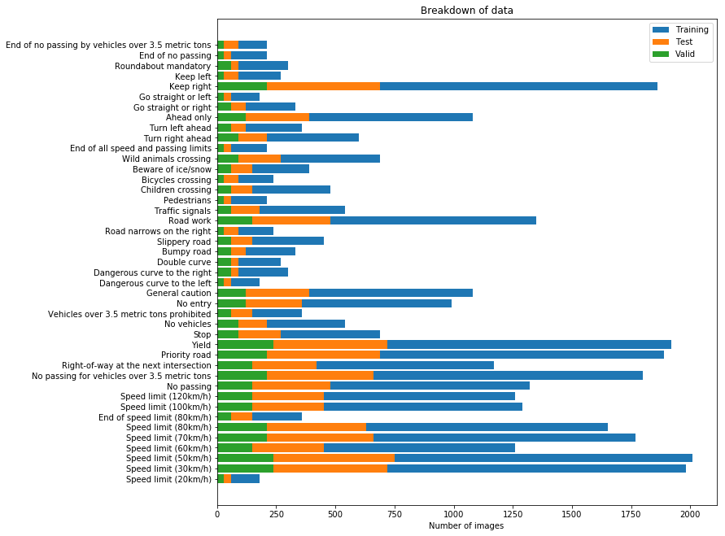
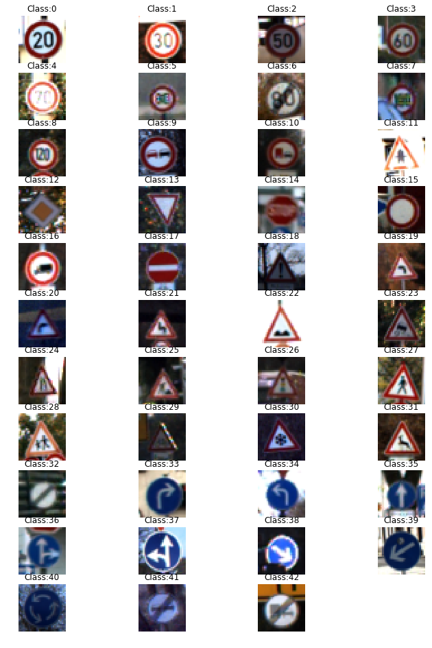
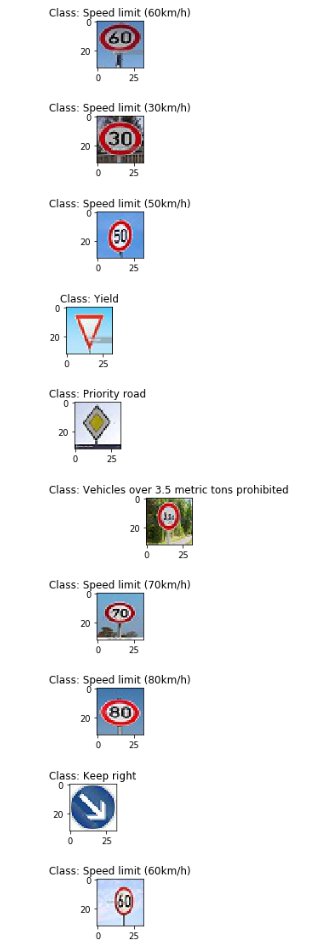
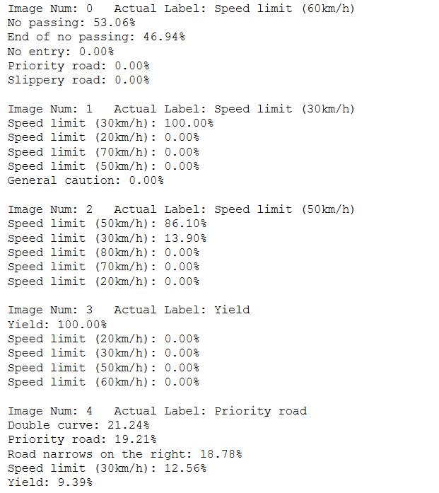
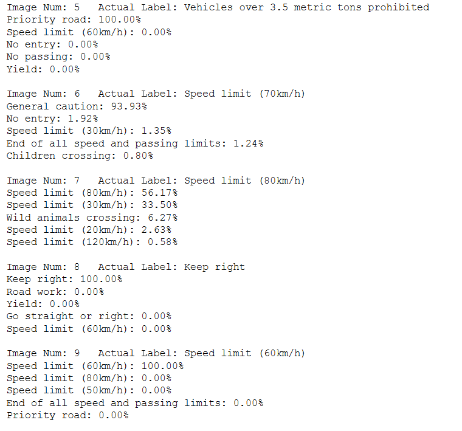
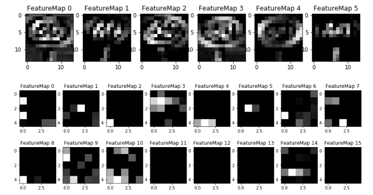

**Traffic Sign Recognition** 

## Writeup Template

### You can use this file as a template for your writeup if you want to submit it as a markdown file, but feel free to use some other method and submit a pdf if you prefer.

---

**Build a Traffic Sign Recognition Project**

The goals / steps of this project are the following:
* Load the data set (see below for links to the project data set)
* Explore, summarize and visualize the data set
* Design, train and test a model architecture
* Use the model to make predictions on new images
* Analyze the softmax probabilities of the new images
* Summarize the results with a written report

[//]: # (Image References)

[image1]: ./examples/visualization.jpg "Visualization"
[image2]: ./examples/grayscale.jpg "Grayscaling"
[image3]: ./examples/random_noise.jpg "Random Noise"
[image4]: ./examples/placeholder.png "Traffic Sign 1"
[image5]: ./examples/placeholder.png "Traffic Sign 2"
[image6]: ./examples/placeholder.png "Traffic Sign 3"
[image7]: ./examples/placeholder.png "Traffic Sign 4"
[image8]: ./examples/placeholder.png "Traffic Sign 5"

## Rubric Points
### Here I will consider the [rubric points](https://review.udacity.com/#!/rubrics/481/view) individually and describe how I addressed each point in my implementation.  

---

### Writeup / README

#### 1. Provide a Writeup / README that includes all the rubric points and how you addressed each one. You can submit your writeup as markdown or pdf. You can use this template as a guide for writing the report. The submission includes the project code.

You're reading it! and here is a link to my [project code](https://github.com/willog11/CarND-Traffic-Sign-Classifier-Project/blob/master/Traffic_Sign_Classifier.ipynb) and also the [html version](https://github.com/willog11/CarND-Traffic-Sign-Classifier-Project/blob/master/Traffic_Sign_Classifier.html)

### Data Set Summary & Exploration

#### 1. Provide a basic summary of the data set. In the code, the analysis should be done using python, numpy and/or pandas methods rather than hardcoding results manually.

I used the python and umpy library to calculate summary statistics of the traffic
signs data set:

* The size of training set is 34799
* The size of the validation set is 4410
* The size of test set is 12630
* The shape of a traffic sign image is (32, 32, 3)
* The number of unique classes/labels in the data set is 43

#### 2. Include an exploratory visualization of the dataset.

To first understand what images I was dealing with I took a sample of each class and displayed them as follows:

After this a bar chart was generated for each class and labelled accordingly. Also included in it was the number of images for each according to the training, validation and test set.
The following chart shows this breakdown:

### Design and Test a Model Architecture

#### 1. Describe how you preprocessed the image data. What techniques were chosen and why did you choose these techniques? Consider including images showing the output of each preprocessing technique. Pre-processing refers to techniques such as converting to grayscale, normalization, etc. (OPTIONAL: As described in the "Stand Out Suggestions" part of the rubric, if you generated additional data for training, describe why you decided to generate additional data, how you generated the data, and provide example images of the additional data. Then describe the characteristics of the augmented training set like number of images in the set, number of images for each class, etc.)

On investigating the image sets, it was clear that some images were very dark or blurred. To correct this the image was first normalized and afterwards different techniques were explored such as sharpening the image.
However each of these extra processing steps were having a negative impact on the validation accuracy so in the end only the normalization was used. This was implemented using opencv normalize function:

~~~
def normalize_img(img):
    img_norm = img.copy() * 0
    cv2.normalize(img, img_norm, alpha=0, beta=255, norm_type=cv2.NORM_MINMAX, dtype=-1)
    return img_norm
~~~

The following images show the improvements in comparison to the original above:

#### 2. Describe what your final model architecture looks like including model type, layers, layer sizes, connectivity, etc.) Consider including a diagram and/or table describing the final model.

My final model was essentially the LeNet model coupled with some dropout functionality, it consisted of the following layers:

| Layer | Logic         		| Description	        					| 
|:-----:|:---------------------|:--------------------------------------------------| 
| **1**	     | Input         		| 32x32x3 RGB image   							| 
|	     | Convolution 5x5     	| 1x1 stride, VALID padding, outputs 28x28x6 	|
|	     | RELU					| RELU activation based on the convulational output	|
|	     | Max pooling	      	| 2x2 stride,  outputs 14x14x6				|
| **2**	     | Convolution 5x5	    | 1x1 stride, VALID padding, outputs 10x10x16      									|
|	     | RELU					| RELU activation based on the convulational output	|
|	     | Max pooling	      	| 2x2 stride,  outputs 5x5x16				|
|	     | Flatten	| Flatten the max pooling output: 400					|
| **3**	     | Fully Connected				| Input = 400. Output = 120.  									|
|	     | RELU					| RELU activation										|
|	     | Dropout					|	Drop 50% randomly of the RELU output						|
| **4**	     | Fully Connected				| Input = 120. Output = 84.  									|
|	     | RELU					| RELU activation										|
|	     | Dropout					|	Drop 50% randomly of the RELU output						|
| **5**	     | Fully Connected				| Input = 84. Output = 43.  									|

#### 3. Describe how you trained your model. The discussion can include the type of optimizer, the batch size, number of epochs and any hyperparameters such as learning rate.

To train the model, the following steps were taken:
1. LeNet was used to calculate the logits required to determine which class each image corresponded to.
2. Softmax cross-entropy coupled with labels that had one hot applied was used to measure the probability error of the LeNet results
3. The loss is calculated based on point 2 above
4. The Adaptive Moment Estimation (Adam) optimizer is used to update the weights and biases based on the learning rate applied (values described below). It is essentially a form of gradient descent algorithm that performs well and is also well supported by tensorflow.
5. Finally the results from step 4 are minimized

The code for this approach is as follows:

~~~
logits = LeNet(x)
cross_entropy = tf.nn.softmax_cross_entropy_with_logits(labels=one_hot_y, logits=logits)
loss_operation = tf.reduce_mean(cross_entropy)
optimizer = tf.train.AdamOptimizer(learning_rate = rate)
training_operation = optimizer.minimize(loss_operation)
~~~

The following hyperparameters below were used for this approach. These were selected after performing an iterative process to ensure the best results were obtained

~~~
rate = 0.001
EPOCHS = 40
BATCH_SIZE = 128
mu = 0
sigma = 0.05
~~~

#### 4. Describe the approach taken for finding a solution and getting the validation set accuracy to be at least 0.93. Include in the discussion the results on the training, validation and test sets and where in the code these were calculated. Your approach may have been an iterative process, in which case, outline the steps you took to get to the final solution and why you chose those steps. Perhaps your solution involved an already well known implementation or architecture. In this case, discuss why you think the architecture is suitable for the current problem.

My final model results were:
* Training set accuracy of 99.7%
* Validation set accuracy of 95.7%
* Test set accuracy of 94.5%

An iterative approach was chosen because LeNet alone did not provide good results thus it was tweaked and improved upon to support the dataset that was used. 
The following is a summary of this iterative approach:

* The first architecture was LeNet with no dropout functions. However it was clear that with this approach the model was over-fitting and the resulting accuracy was poor.
* As the architecture clearly was having an over-fitting issue I decided to introduce dropout logic to the final 2 layers. This worked well and it resulted in a 3 - 5% gain in the validation accuracy
* The parameter values were tuned iteratively. Both the learning rate and sigma hyperparams were tweaked to ensure over-fitting was not an issue. Additionally more epochs were added to gaurantee the CNN would maximise its training process by not finishing too early.
* The use of convnet layers was important as it enables the process of taking an original RGB image with depth 3 and applying a logic flow which results in N layers. These N layers can be further processed easily with maxpooling, dropout, RELU, etc to result in an accurate CNN 

LeNet was chosen for the following reasons:
* Its a well known architecture which can easily be built upon to improve results, such as the use of dropout. 
* It is also a relatively simple network to implement and adapt for different use cases. 
* Its vital that the training and validation accuracy be analysed before validation on the test set of images. If the validation accuracy is not at a high level then the resulting CNN may not perform well on any other dataset. Thus the CNN must have a high training and validation accuracy before testing on the final test set. This final test set can also only be tested once else it risks leading to a biased result. This can happen if the test results  are used in the tweaking of the CNN hyper-parameters or logic.
 

### Test a Model on New Images

#### 1. Choose five German traffic signs found on the web and provide them in the report. For each image, discuss what quality or qualities might be difficult to classify.

I selected more than the suggested number of images to further test my CNN with. This is because I wanted to get a wider variety of images to give a less biased result.

The following 10 (32x32x3) images with labels applied were downloaded. I manually added the labels in the code (see below). Note in each case the same preprocessing was applied as before.

~~~
images_test = []
images_label = [3,1,2,13,12,16,4,5,38,3]
i=0
for file in sorted(os.listdir("extra_images")):
    if file.endswith(".jpg"):
        img = imread("extra_images/" + file)
        images_test.append(normalize_img(img))
        plt.figure(figsize=(1,1))
        plt.title("Class: "+str(label_desc[images_label[i]]))
        plt.imshow(img)
        i+=1
plt.show()
~~~

#### 2. Discuss the model's predictions on these new traffic signs and compare the results to predicting on the test set. At a minimum, discuss what the predictions were, the accuracy on these new predictions, and compare the accuracy to the accuracy on the test set (OPTIONAL: Discuss the results in more detail as described in the "Stand Out Suggestions" part of the rubric).

Here are the results of the prediction:

| Image			        |     Prediction	        					| 
|:---------------------:|:---------------------------------------------:| 
| Speed limit (60km/h)      		| No passing								| 
| Speed limit (30km/h)    			| Speed limit (30km/h)										|
| Speed limit (50km/h)					| Speed limit (50km/h)										|
| Yield	      		| Yield				 				|
| Priority road 		| Double curve      							|
| Vehicles over 3.5 metric tons prohibited 		| Priority road       							|
| Speed limit (70km/h) 		| General caution     							|
| Speed limit (80km/h 		| Speed limit (80km/h     							|
| Keep right 		| Keep right     							|
| Speed limit (60km/h) 		| Speed limit (60km/h)      							|

The model was able to correctly guess 6 of the 10 traffic signs, which gives an accuracy of 60%. The reason for the average performance could be due to the image set used during training. Some of these images may have been very dark\blurry\obscured so the resulting prediction for that class would be affected accordingly. Additionally if the training dataset lacks images in some classed (3.5 metric ton sign for example) then the resulting prediction for these images will also be poor.

#### 3. Describe how certain the model is when predicting on each of the five new images by looking at the softmax probabilities for each prediction. Provide the top 5 softmax probabilities for each image along with the sign type of each probability. (OPTIONAL: as described in the "Stand Out Suggestions" part of the rubric, visualizations can also be provided such as bar charts)

The following block of code is how I predicted what each the images may be. 

~~~
with tf.Session() as sess:
    saver.restore(sess, tf.train.latest_checkpoint('.'))
    softmax = tf.nn.softmax(predicted_logits)
    top_5 = sess.run(tf.nn.top_k(softmax, k=5))

    print()
    for i in range(len(images_test)):
        print("Image Num: {:d}   Actual Label: {:s}".format(i, label_desc[images_label[i]]))
        for j in range(5):
            print("{:s}: {:.2f}%".format(label_desc[top_5[1][i][j]], top_5[0][i][j]*100))
        print()
~~~

Additionally, also included is the predicted result for each image:

  

The following analysis is clear from these images:

* Signs which are similar to 30kph are difficult to distinguish between, such as 80 and 50 kph as the both contain curly like shapes.
* 30kph sign results in a probability of 100% being the 30kph sign. Additionally its clear from the previous bar charts that this class contains the 2nd most amount of training data.
* The keep right image is very well predicted as the image is very clean, in that only the sign is visible. It also has >1750 training images associated with it. Thus improving the prediction capabilities.
* The vehicle over 3 ton prohibited sign has very poor prediction but likewise it has very few training images in relation to the rest of the images downloaded.
* The above results reflect somewhat on the lack of training scenes from some of these classes and the resulting poor prediction performance for them. Likewise training sets with a large amount of data of certain classes may result in predictions more biased towards these classes.

### (Optional) Visualizing the Neural Network (See Step 4 of the Ipython notebook for more details)
#### 1. Discuss the visual output of your trained network's feature maps. What characteristics did the neural network use to make classifications?

For this optional task the following code was used to pass in the additional image dataset and to plot the resulting covnet layers:

~~~
with tf.Session() as sess:
    saver.restore(sess, tf.train.latest_checkpoint('.'))
    conv1 = sess.graph.get_tensor_by_name('conv1:0')
    outputFeatureMap(images_test, conv1, activation_min=-1, activation_max=-1, plt_num=0)
    conv2 = sess.graph.get_tensor_by_name('conv2:0')
    outputFeatureMap(images_test, conv2, activation_min=-1, activation_max=-1, plt_num=1)
~~~

This resulted in the following feature map images:

The following analysis is clear from this image: 
* In each case for this feature map the covnet is clearly selecting features with changes in colour and gradient.
* Each feature map is also significantly different than the previous maps.
* Also in some cases the colours are swapped. Take for example the black numbers in the sign, in one of the feature maps these remain as black but in others they are white.

